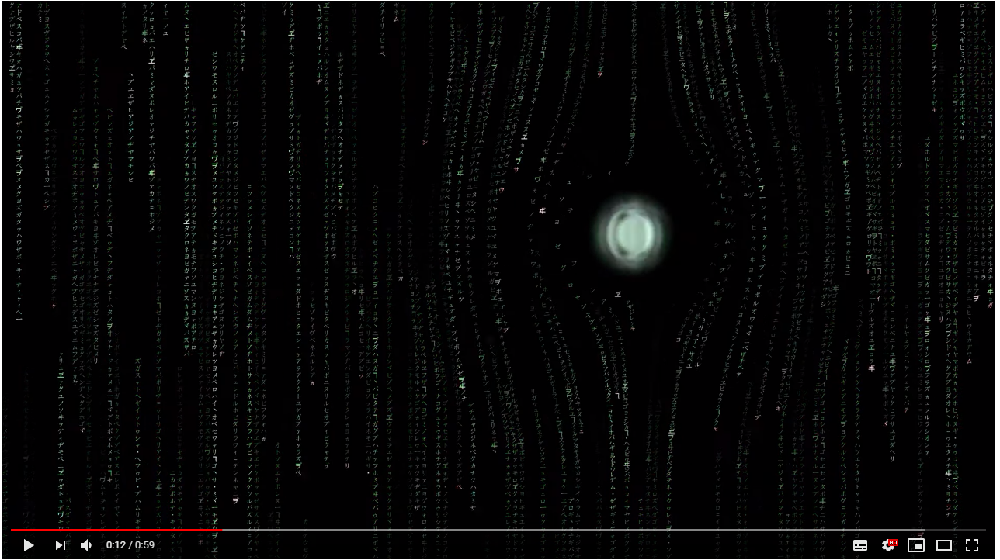

# Matrix_Effect

### A remake of a classic effect

#### Info
A simple symbol scrolling effect, inspired by the movie The Matrix. When clicking the mouse, a force field is generated. It can be manipulated by dragging the mouse around.

#### Usage
Simply clone the project and [open it with Processing] (https://processing.org/download/). 
The sketch uses the Minim library sou you'll have to add that via Sketch > Import Library.. > Add library. 
It uses the Hiragino-Sans font for the symbol rendering, but that should be installed by default when you're using a mac.
